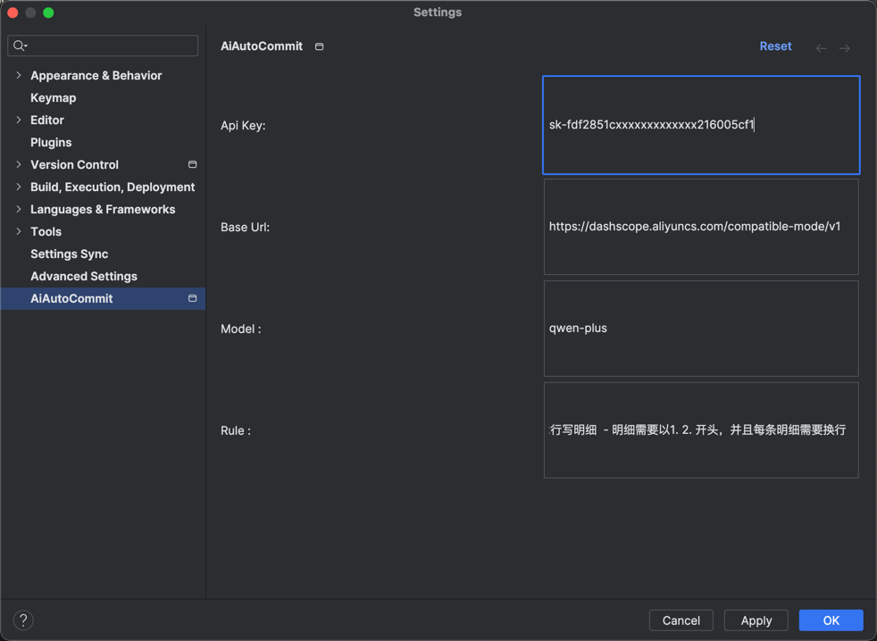
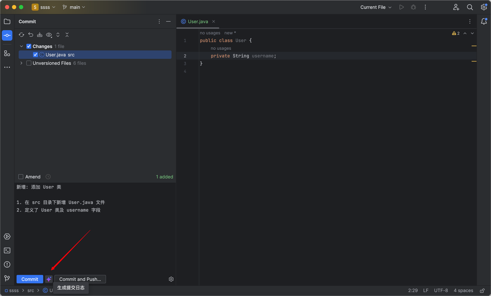

# AI Auto Commit Idea Plugin

**AI 自动编写 Git 提交日志的 IntelliJ IDEA 插件**  
告别手动编写提交日志的繁琐！本插件基于 AI 大模型，智能分析代码变动并生成清晰规范的 Git Commit Message，助你提升开发效率。

---

## ✨ 核心功能

- **智能生成 Commit Message**：自动解析代码差异，生成符合规范的提交日志。
- **多模型支持**：可选 OpenAI、DeepSeek 、通义千问等主流 AI 服务（理论上遵循OpenApi的都支持）。
- **一键操作**：IDE 内直接调用，无需切换工具。
- **自定义模板**：支持按团队规范调整日志格式。

---

## ✈️ 模型支持
* deepseek [[获取 apiKey]](https://platform.deepseek.com/api_keys)  [[获取 baseUrl / Model]](https://api-docs.deepseek.com/zh-cn/)
* ChatGPT  [[获取 apiKey]](https://platform.openai.com/settings/organization/api-keys)  [[获取 baseUrl / Model]](https://platform.openai.com/docs/api-reference/introduction)

## 🚀 快速开始（3 步上手）

1. **安装插件**
    - 通过 JetBrains Marketplace 搜索 `AiAutoCommit` 安装。
2. **配置 AI 服务**
    - 获取 API Key，填入插件设置页面的 `AI_API_KEY`。
      
3. **使用**
    - 在提交代码时点击生成按钮，自动生成提交日志并填充到输入框。
      

---

## 🔧 高级配置

- **选择 AI 模型**：在设置中切换不同模型。
- **自定义规则**： 支持修改生成规则，以适配你的团队规范。

---

## ⭐️ 支持与感谢

如果本插件让你的开发体验更愉悦，请：

1. 点个 **Star** 🌟 支持开发者。
2. 遇到问题？提交 [Issue]，我会尽快响应！
3. 推荐给团队伙伴，告别低效提交日志！

--- 

**开源协议**：MIT License | 为开发者而生 🚀  
